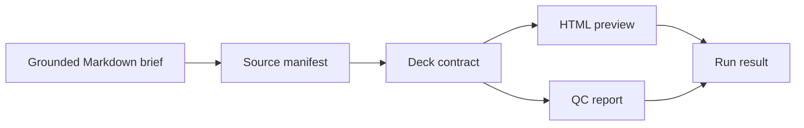

# Research-to-Deck

A public-safe AI product workflow demo for turning grounded research notes into a deck contract, browser preview, QC report, and run result.

This repository packages the public-facing idea behind a larger local deck generation system: source material should become a traceable presentation artifact through a stable contract, not through one-off slide editing.

- Portfolio homepage: <https://firejw.github.io/research-to-deck/>
- Demo runbook: [docs/demo-runbook.md](docs/demo-runbook.md)
- Security notes: [docs/security-and-privacy.md](docs/security-and-privacy.md)

## Why This Exists

Research-to-deck work usually fails in predictable ways:

- The deck loses the source trail.
- Slide structure gets mixed with visual rendering too early.
- HTML preview and PPTX export drift apart.
- There is no QC artifact that explains what was generated.
- Private research packages accidentally leak into public demos.

This project demonstrates a safer product shape: convert a grounded Markdown brief into a deck contract first, then render outputs and validate the bundle.

## What It Generates

The demo command writes a self-contained run bundle under `dist/demo/`:

```text
dist/demo/
  request.json
  source_manifest.json
  deck_contract.json
  index.html
  qc_report.md
  run_result.json
```

## Quick Start

```bash
npm test
npm run generate
```

Open `dist/demo/index.html` after generation.

## Workflow



## Product Principles

- `Contract first`: source parsing produces a stable `deck_contract.json` before rendering.
- `Traceable outputs`: every run writes request, source manifest, contract, preview, QC, and result files.
- `Public-safe fixtures`: sample briefs are synthetic and do not depend on private workspaces.
- `Renderer separation`: the demo HTML renderer is deliberately simple; the contract is the durable product layer.
- `Fail closed`: empty input or missing titles should fail instead of producing a false-success deck.

## Demo Input

The default sample lives at [examples/research-brief.md](examples/research-brief.md). It contains a short product strategy brief with headings, paragraphs, and bullet points.

## Demo Output Contract

The generated `deck_contract.json` uses this shape:

```json
{
  "schema_version": "deck_contract/v1",
  "title": "Research-to-Deck Briefing",
  "source_refs": [
    {
      "id": "primary",
      "path": "examples/research-brief.md"
    }
  ],
  "slides": [
    {
      "id": "slide-1",
      "headline": "Why It Matters",
      "items": [
        {
          "kind": "bullets",
          "points": ["Preserve source traceability"]
        }
      ]
    }
  ]
}
```

## Portfolio Framing

This project is useful as an AI PM / product strategy portfolio artifact because it shows:

- turning messy research into a repeatable workflow
- separating source truth from presentation rendering
- designing evaluation and QC surfaces
- making AI-generated artifacts reviewable by humans
- keeping public demos separate from private research data

## Documentation

- [Portfolio homepage](https://firejw.github.io/research-to-deck/)
- [Homepage copy](docs/index.md)
- [Case study](docs/case-study.md)
- [Architecture](docs/architecture.md)
- [Demo runbook](docs/demo-runbook.md)
- [Security and privacy](docs/security-and-privacy.md)

## GitHub Repository Profile

- Name: `research-to-deck`
- Description: `Public-safe research-to-deck workflow with deck contracts, HTML preview, QC reports, and traceable run bundles.`
- Topics: `ai-product-management`, `research`, `presentations`, `deck-generation`, `workflow-automation`, `evaluation`, `portfolio-project`, `human-in-the-loop`

## Open-Source Boundary

This public repository uses synthetic fixtures and a small demo implementation. It does not publish private research notes, customer materials, local vault paths, generated client decks, API keys, browser profiles, or account data.
